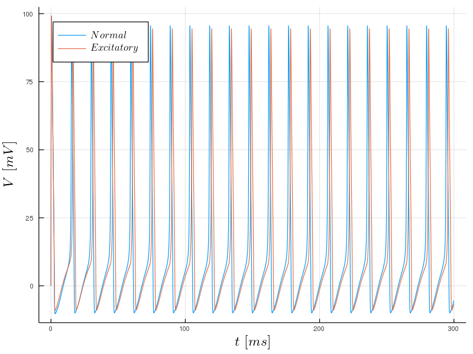
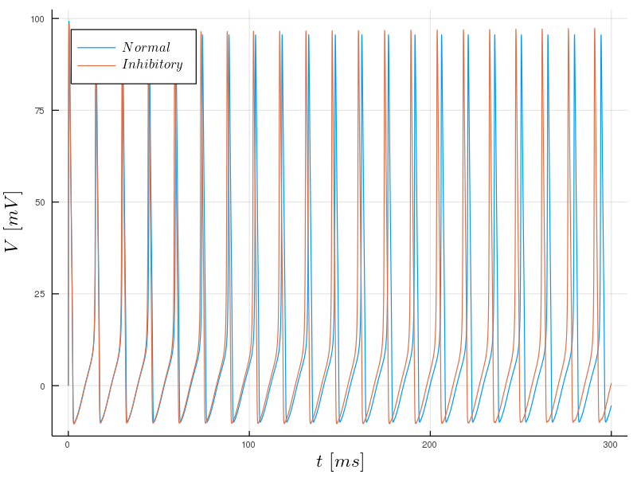
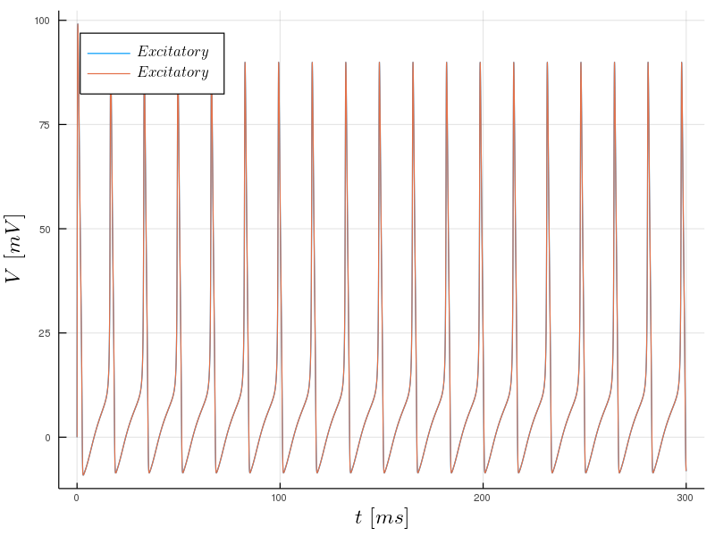
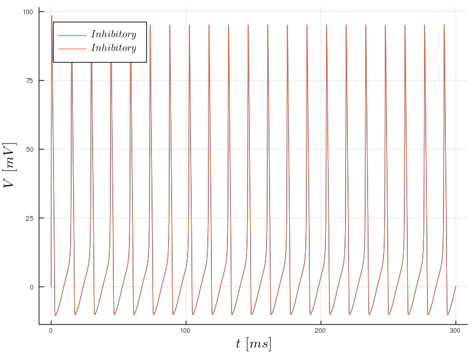
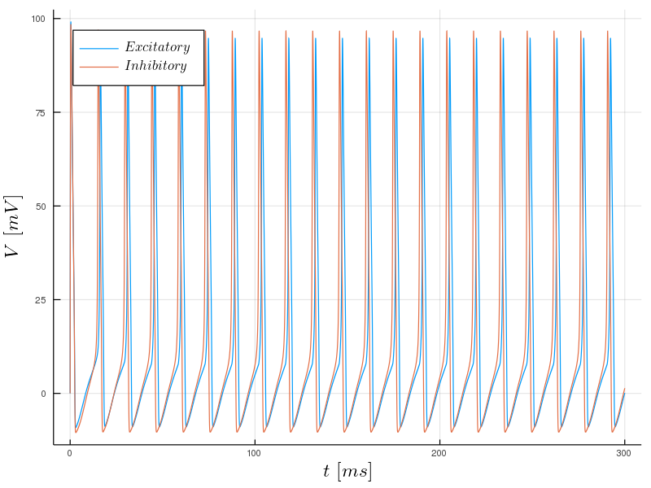

# Coupled-HH-neurons
Variation of the Hodgkin-Huxley model to study two coupled neurons. 

The Hodgkin-Huxley model is a four dimensional system of differential equations used to study the behaviour of a neuron. More information of the model and its results can be found in this [repository](https://github.com/agimenezromero/Hodgkin-Huxley-model)

Here, two coupled neurons are considered. Each neuron is represented by the original HH model and the coupling between them is considered as an extra term representing the synaptic current between the neurons.

Some results are shown below.

## Unidirectional excitatory coupling

## Unidirectional inhibitory coupling

## Mutual excitatory coupling

## Mutual inhibitory coupling

## Mutual excitatory-inhibitory coupling

